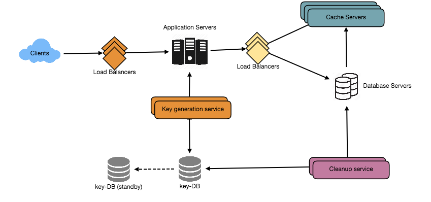
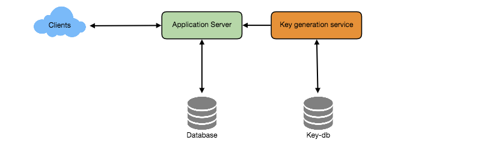

# TinyURL

## Summary

## Requirements
- **Features**
  - Create a ***short url*** out of any url
  - When short url is accessed, service ***redirects*** user to normal url
  - Users can choose ***custom short url***
  - Short links will ***expire***. User can choose expiration time

- **Good Practice**
  - ***Highly available***
  - ***Low latency*** on redirection
  - Short links shoudl ***not be guessable***

## Estimations
- **Assumption**
  - ***Read-heavy***
  - ***100:1*** read/write ratio

- **Traffic estimates**
  - **500M** new URL shortenings per month, `100:1 * 500M` = **50B** redirections per month
  - ***New short url per second:*** `500 million / (30 days * 24 hours * 3600 seconds)` = **~200 URLs/s**
  - ***URLs redirections per second:*** `50 billion / (30 days * 24 hours * 3600 sec) =` **~19K/s**

- **Storage estimates**
  - Assume we store each short url for **5 years** and each object takes **500 bytes**
  - ***Total objects:*** `500 million * 5 years * 12 months` = **30 billion**
  - ***Total storage:*** `30 billion * 500 bytes` = **15 TB**

- **Bandwidth estimates**
  - ***Write:*** `200 URL/s * 500 bytes/URL` = **100 KB/s**
  - ***Read:*** `19K URL/s * 500 bytes/URL` = **~9 MB/s**

- **Cache memory estimates**
  - Follow the **80-20 rule**, assuming 20% of URLs generate 80% of traffic, cache 20% hot URLs
  - ***Requests per day:*** `19K * 3600 seconds * 24 hours` = **~1.7 billion/day**
  - ***Cache 20%:*** `0.2 * 1.7 billion * 500 bytes` = **~170GB**

- **Summary**
  - Assuming **500 million new URLs per month** and **100:1 read:write ratio**
  
  Category | Calculation | Estimate
  ----| ---- | ----
  New URLs | 500 million / (30 days * 24 hours * 3600 seconds) | 200 /s
  URL redirections | 500 million * 100 / (30 days * 24 hours * 3600 seconds) | 19 K/s
  Incoming data | 500 bytes/URL * 200 URL/s | 100 KB/s
  Outgoing data | 500 bytes/URL * 19K URL/s | 9 MB/s
  Storage for 5 years | 500 bytes/URL * 500 million * 60 months | 15 TB
  Memory for cache | 19K URL * 3600 seconds * 24 hours * 500 bytes * 20% | 170 GB

## System APIs
### `createUrl`
`createURL(api_dev_key, original_url, custom_alias=None, user_name=None, expire_date=None)`
- **Parameters**
  Name | Type | Note
  ---- | ---- | ----
  `api_dev_key` | `string` | The API developer key of a registered account. This will be used to, among other things, throttle users based on their allocated quota.
  `original_url` | `string` | Original URL to be shortened.
  `custom_alias` | `string` | Optional custom key for the URL.
  `user_name` | `string` | Optional user name to be used in encoding.
  `expire_date` | `string` | Optional expiration date for the shortened URL.
- **Returns**
  - `string`
  - A successful insertion ***returns the shortened URL***; otherwise, it returns an error code

### `deleteUrl`
`deleteURL(api_dev_key, url_key)`
- Parameters
  Name | Type | Note
  ---- | ---- | ----
  `api_dev_key` | `string` | The API developer key of a registered account. This will be used to, among other things, throttle users based on their allocated quota.
  `url_key` | `string` | Short URL.
- **Returns**
  - `string`
  - A successful deletion **returns ‘URL Removed’**

## Database Design
- **Observations**
  - Need to store billions of records.
  - Each object is small (less than 1K).
  - No relationships between records—other than storing which user created a URL.
  - Read-heavy.
  - **NoSQL** choice would also be easier to scale.
  - Comment: SQL with sharding should also work

- **Schema**
  - **URL**
    Column | Type
    ---- | ----
    `hash` | varchar(16)
    `original_url` | varchar(512)
    `creation_date` | datetime
    `expiration_date` | datetime
    `user_id` | int
  - **User**
    Column | Type
    ---- | ----
    `name` | varchar(20)
    `email` | varchar(32)
    `creation_date` | datetime
    `last_login` | datetime

## Basic System Design and Algorithm
### Encoding actual URL
- **Compute unique hash**
  - `base64`: A-Z, a-z, 0-9, `-`, `.`
  - ***6 letters:*** 64 ^ 6 = ~68.7 billion ***(enough)***
  - ***8 letters:*** 64 ^ 8 = ~281 trillion
- **Issues with this approach**
  - ***Same URL*** from multiple users
  - ***URL-encoded***
- **Workaround**
  - Append an ***increasing sequence number*** to each input URL, and generate a hash for it
  - Append ***user id*** to input URL

### Generating url keys offline
Have a standalone Key Generation Service (KGS) that generates random six letter strings beforehand and stores them in a database. Not only are we not encoding the URL, but we won’t have to worry about duplications or collisions. KGS will make sure all the keys inserted into key-DB are unique.
- **Standalone Key Generation Service (KGS)**
  - Generate random 6 letter strings and store them in a database (key DB)
  - When a short URL is needed, take one from the key DB

- **Key DB size**
  - 6 characters/key * 68.7B unique keys = 412 GB

- **Concurrency issue**
  - KGS can use two tables to store keys: one for keys that are not used yet, and one for all the used keys. As soon as KGS gives keys to one of the servers, it can move them to the used keys table. GS can always keep some keys in memory so that it can quickly provide them whenever a server needs them.

- **Key lookup**
  - When a key is found, issue an "HTTP 302 Redirect" status and passing the stored URL.
  - When a key is not found, issue an "HTTP 404 Not Found", or redirect to homepage.
  

## Data Partitioning and Replication
To ***scale*** out our DB, we need to partition it so that it can store information about billions of URLs. We need to come up with a partitioning scheme that would divide and store our data to different DB servers.
- **Range Based Partitioning**
  - Store URLs in separate ***partitions*** based on the first letter of the URL or the hash key.
  - Combine certain less frequently occurring letters into one database partition.
  - ***Problem:*** Unbalanced servers
- **Hash-Based Partitioning**
  - Take a hash of the short URL we are storing, and calculate which partition to use based upon the hash.
  - ***Problem:*** This approach can lead to overloaded partitions 
  - ***Solution:*** Use [consistent hashing](../basics/consistent-hashing.md)

## Cache
Cache URLs that are ***frequently accessed***. We can use some off-the-shelf solution like Memcache, which can store full URLs with their respective hashes
- **Cache eviction policy**
  - ***LRU:*** discard the least recently used URL first
- **Cache update**
  - ***Cache miss:*** hit backend database and pass new entry to all cache replicas

## Load Balancer (LB)
- **LB locations**
  - Between Clients and Application servers
  - Between Application Servers and database servers
  - Between Application Servers and Cache servers

## DB Sweeping
A separate Cleanup service can run periodically to remove expired links from our storage and cache.

## Telemetry
- ***Statistics*** about the system: how many times a short URL has been used
- ***Statistics worth tracking:*** country of the visitor, date and time of access, web page that refers the click, browser, or platform from where the page was accessed

## Security and Permissions
- Store ***permission level*** (public/private) with each URL in the database to only user restricted URLs
- Send an error (HTTP 401) for ***unauthorized access***
