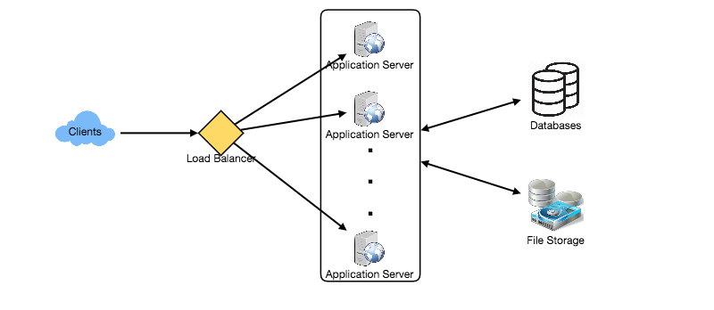
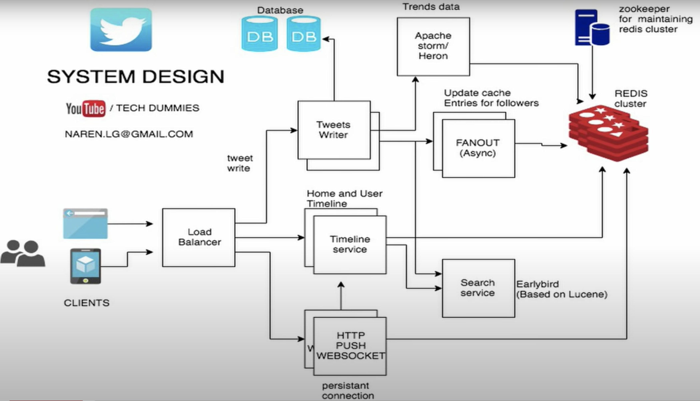
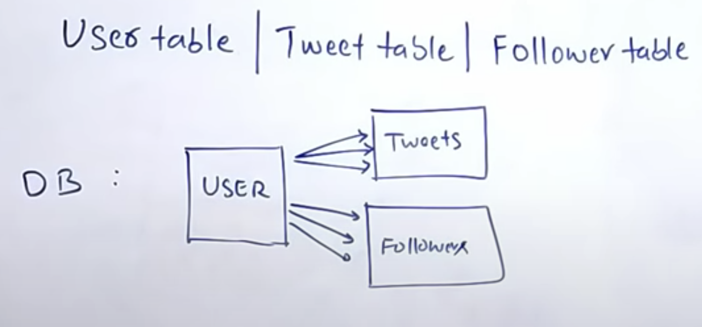
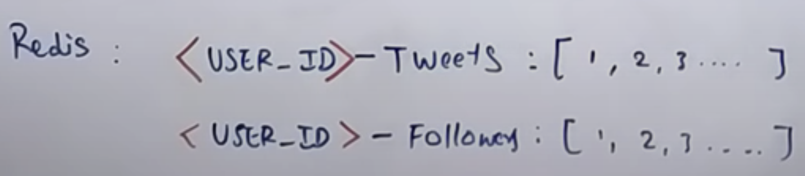
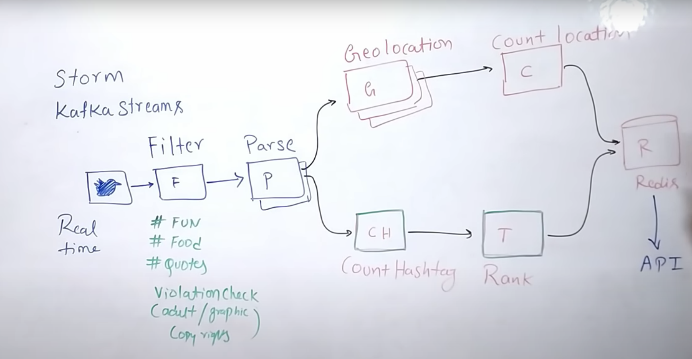

# Twitter

## Summary

## Requirements
- **Features**
  - User can ***post*** tweets
  - User can ***follow*** other users
  - User can mark tweets as ***favorite***
  - ***Timerline***
  - ***Trends*** 

- **Good Practice**
  - ***Highly available***
  - ***Low latency*** for timeline generation
  - ***Eventual consistency*** 

- **Extended Features**
  - Search ***tweets*** 
  - Reply ***tweets*** 
  - ***Tag*** other users
  - Tweet ***notification***
  - Follow ***suggestions*** 

## Estimations
- **Assumption**
  - ***200+M*** daily users
  - ***Read-heavy***
  - ***1000:1*** read/write ratio
  - ***100M*** tweets per day

- **Traffic estimates**
  - Assume **200M** users per day view on average 20 tweets from 5 people twice per day.
  `200M DAU * ((2 + 5) * 20 tweets)` = **28 B** tweets loaded per day

- **Storage estimates**
  - Allow 140 chracters per tweet and assume we need ***2 bytes per character*** and ***30 bytes to store metadata*** such as userId, timestamp, tweetId.
  `100M * (280 + 30) bytes` = **30 GB** of storage per day
  - As for media, assume every 5th tweet has a photo and every 10th has a video. Assume average ***photo*** size is ***200 KB*** and average ***video*** is **2 MB**
  `(100M/5 photos * 200KB) + (100M/10 videos * 2MB)` ~= **24 TB** storage per day

- **Bandwidth estimates**
  - ***24TB*** translates to ~= ***290 MB/S***

- **Cache memory estimates**
  - Follow the **80-20 rule**, assuming 20% of URLs generate 80% of traffic, cache 20% hot URLs
  - ***Requests per day:*** `19K * 3600 seconds * 24 hours` = **~1.7 billion/day**
  - ***Cache 20%:*** `0.2 * 1.7 billion * 500 bytes` = **~170 GB**
  
  Category | Calculation | Estimate
  ----| ---- | ----
  New URLs | 500 million / (30 days * 24 hours * 3600 seconds) | 200 /s
  URL redirections | 500 million * 100 / (30 days * 24 hours * 3600 seconds) | 19 K/s
  Incoming data | 500 bytes/URL * 200 URL/s | 100 KB/s
  Outgoing data | 500 bytes/URL * 19K URL/s | 9 MB/s
  Storage for 5 years | 500 bytes/URL * 500 million * 60 months | 15 TB
  Memory for cache | 19K URL * 3600 seconds * 24 hours * 500 bytes * 20% | 170 GB

## System APIs
### `tweet`
`tweet(api_dev_key, tweet_data, tweet_location, user_location, media_ids, maximum_results_to_return)`
- **Parameters**
  Name | Type | Note
  ---- | ---- | ----
  `api_dev_key` | `string` | The API developer key of a registered account. This will be used to, among other things, throttle users based on their allocated quota.
  `tweet_data` | `string` | The text of the tweet, typically up to 140 characters.
  `tweet_location` | `string` | Optional location (longitude, latitude) this Tweet refers to.
  `user_location` | `string` | Optional location (longitude, latitude) of the user adding the tweet.
  `media_ids` | `number[]` | Optional list of media_ids to be associated with the Tweet. (All the media photo, video, etc. need to be uploaded separately).
- **Returns**
  - `string`
  - A successful post will return the URL to access that tweet. Otherwise, an appropriate HTTP error is returned.

## Database & Redis Design

- **Schema**
  - **User**
    Column | Type
    ---- | ----
    `user_id` | varchar(20)
    `name` | varchar(20)
    `email` | varchar(32)
    `creation_date` | datetime
    `last_login` | datetime
  - **Tweet**
    Column | Type
    ---- | ----
    `tweet_id` | varchar(20)
    `content` | varchar(32)
    `num_favorites` | int
    `last_login` | datetime
  - **Followers**
    Column | Type
    ---- | ----
    `users_id[]` | varchar
  - **Favorite**
    Column | Type
    ---- | ----
    `creation_date` | datetime

- **Database**
We will use ***database*** to store relation data such as User, Tweet and Follower tables. ***User*** has ***one to many relationships*** with ***Tweet*** and ***Follower*** tables. 
***Retweets*** are a copy of the tweets so we can different **User** pointing to the same tweet

- **Redis**
Store ***data in memory*** and is ***persistent***. Scales horizontally (***clusters***)
Redis need ***key*** to save data. The key will return all the ***ids*** in the respective table 
***<USER_ID>-Tweets*** gives all the ***tweets*** that the user has made  
***<USER_ID>-Followers*** gives all the ***followers*** that follow the user

## Basic System Design and Algorithm
***User Timeline has one user's tweets and Home Timeline it's a custom timline for the current user with tweets of all the people he follows***
### User Timeline
Since is the application is user heavy and it will have a high latency to be reading to load the ***Tweet*** table by user_id, we need a cache layer using ***Redis***. 
- **User Timeline in Redis**
  - `user_id-user_tweets :[1,2,3,4]` each number in the array represents a tweet
  - `tweet_id-tweet : "hello world tweet"`, by providing the tweet id we can get the tweet from the previous call

- **Home Timeline (Fanout Approach)**
  - When a ***user*** makes a tweet, 
    1. Save it on db
    2. Add it to user timeline
    3. Send tweet to Home Timeline of all his followers
  - This approach ***works*** for ***average user***, but it ***doesn't work*** for ***celebrities***  

- **Home Timeline (Celebrities Approach)**
  - When a ***user*** makes a tweet, 
    1. Save it on db
    2. Add it to user timeline
  - When a ***follower*** loads its Home Timeline it will ***check*** if he follows any ***celebrity*** and if he does will grab the tweets from the celebrity User Timeline to his Home Timeline

## Trending
- **Factors taken in trending**
  - ***Volume*** of tweets
  - ***Time*** taken to generate the tweets
- **Stream Processing Frameworks**
  - Storm, Kafka

Each new tweet gets into a queue where if wil ***filter*** common hashtags that don't qualify and validates that it doesn't have any violation. Then, it will ***parse*** the tweet in case users are not using a particular hashtag, but the tweet has some keywords. 
***Count hashtag*** will count the number of tweets in a particular time range. 
***Rank*** gives a rank to a particular tweet. 
***Geolocation*** figures out an appropriate location for a given a hashtag. 
All data from pipeline is fed into ***Redis*** and from there it can be consumed by any API and show it to a UI.

## Search (Early bird)
- Each tweet its ***parse*** and Twitter creates a table of each word and map it to tweets that have that word.
   Word | Tweets ID
    ---- | ----
    hello | ...
    table | ...

## Replication and Fault Tolerance
Since Twitter is ***read heavy***
- Create multiple ***secondary database*** server for each db partition
- Each ***secondary database*** will be used for ***read traffic only***
- ***New tweets*** are written in primary db and get replicated to secondaries
- System become ***fault tolerant*** because if a main db goes down we can easily failover to a secondary server

## Load Balancer (LB)
- **LB locations**
  - Between Clients and Application servers
  - Between Application Servers and database replication servers
  - Between Application Servers and Cache servers
