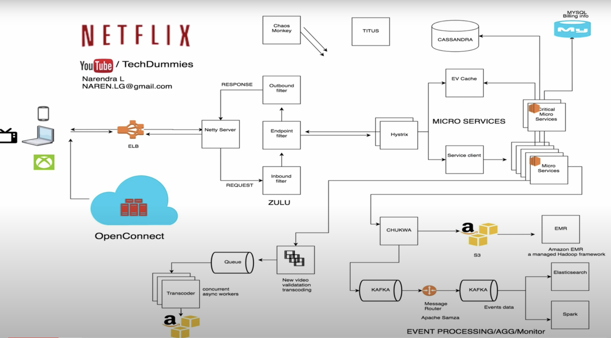
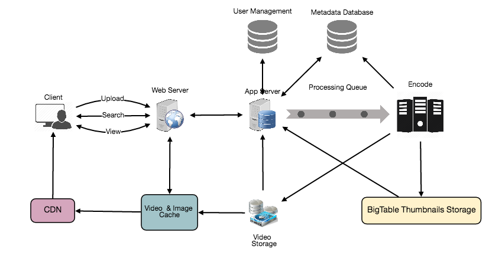

# Youtube/Netflix

## Summary

## Requirements
- **Features**
  - User can ***upload*** videos
  - User can ***view*** and ***share*** videos
  - User can ***search*** video 
  - User can ***comment*** video 
  - Videos ***statistics(likes,views)***

- **Good Practice**
  - ***Highly available***
  - ***Low latency*** for videos
  - ***Eventual consistency*** 

## Estimations
- **Assumption**
  - ***800M*** daily users
  - Avg user views ***5 videos*** per day
  - ***200:1*** view/upload ratio
  - ***500 hours*** of video uploaded per minute
  - Avg video is ***50MB***

- **Traffic estimates**
  - Per assumptions, *views per second*
  `800M * 5 / 86400 sec` = **46K views/sec**

- **Storage estimates**
  - Total storage needed for *videos uploaded in a minute*
  `500 hours * 60 min * 50MB` = ***1500 GB/min*** (25 GB/sec)

- **Bandwidth estimates**
  - *500 hours* of video uploads per minute and each video upload has bandwidth of 10MB/min, we would be getting 300GB of uploads every minute.
  `500 hours * 60 mins * 10MB` = ***300GB/min*** (5 GB/sec)

  
  Category | Calculation | Estimate
  ----| ---- | ----
  Traffiic | 800M * 5 / 86400 sec | 46K views/sec
  Storage | 500 hours * 60 min * 50MB | 1500 GB/min
  Bandwith | 500 hours * 60 mins * 10MB | 300GB/min

## System APIs

### `uploadVideo`
`uploadVideo(api_dev_key, video_title, vide_description, tags[], category_id default_language, recording_details, video_contents)`
- **Parameters**
  Name | Type | Note
  ---- | ---- | ----
  `api_dev_key` | `string` | The API developer key of a registered account. This will be used to, among other things, throttle users based on their allocated quota.
  `video_title` | `string` | Title of the video.
  `video_description` | `string` | Optional description of the video.
  `tags` | `string[]` | Optional tags for the video.
  `category_id` | `string` | Category of the video, e.g., Film, Song, People, etc.
  `default_language` | `string` | For example English, Mandarin, Hindi, etc.
  `recording_details` | `string` | Location where the video was recorded.
  `video_contents` | `stream` | Video to be uploaded.  
- **Returns**
  - `string`
  - A successful upload will return HTTP 202 (request accepted) and once the video encoding is completed the user is notified through email with a link to access the video. 

### `searchVideo`
`searchVideo(api_dev_key, search_query, user_location, maximum_videos_to_return, page_token)`
- **Parameters**
  Name | Type | Note
  ---- | ---- | ----
  `api_dev_key` | `string` | The API developer key of a registered account of our service.
  `search_query` | `string` | A string containing the search terms.
  `user_location` | `string` | Optional location of the user performing the search.
  `maximum_videos_to_return` | `number` | Maximum number of results returned in one request.
  `page_token` | `string` | This token will specify a page in the result set that should be returned.
- **Returns**
  - `JSON`
  - A JSON containing information about the list of video resources matching the search query. Each video resource will have a video title, a thumbnail, a video creation date, and a view count.

### `streamVideo`
`streamVideo(api_dev_key, video_id, offset, codec, resolution)`
- **Parameters**
  Name | Type | Note
  ---- | ---- | ----
  `api_dev_key` | `string` | The API developer key of a registered account of our service.
  `video_id` | `string` |A string to identify the video.
  `offset` | `number` | We should be able to stream video from any offset; this offset would be a time in seconds from the beginning of the video. If we support playing/pausing a video from multiple devices, we will need to store the offset on the server. This will enable the users to start watching a video on any device from the same point where they left off.
  `codec` | `string` | We should send the codec and resolution info in the API from the client to support play/pause from multiple devices. Imagine you are watching a video on your TV’s Netflix app, paused it, and started watching it on your phone’s Netflix app. In this case, you would need codec and resolution, as both these devices have a different resolution and use a different codec.
- **Returns**
  - `STREAM`
  - A media stream (a video chunk) from the given offset.

## High Level System Design

- ### Netflix
  - Front end web application uses ReactJS because of ***startup speed***, ***runtime performance*** and ***modularity***
  - All the content is served on AWS and the video streaming from OpenConnect. ***OpenConnect*** is Netflix own video streaming service that acts like a ***CDN*** and it is replicated along multiple countries to ***reduce latency.*** AWS handles recommendations and all the content showed in the UI.
  - Uses a 2 dial balancing scheme of ***ELB.*** This means that the ELB has two layers, the first will route traffic between Zones and second layer of ELB will route traffic between servers on chosen zone.
  - Videos are ***preprocessed*** by Netflix, where they ***transcode*** each movie. Transcode means generating different formats with different resolutions to send the appropriate depending on the device requesting it. Creates ~200 formats. This is done using ec2 servers and uploading the created formats to s3 which then will be send to OpenConnect
  - ZUUL: Gateway service that provides dynamic routing and monitoring. 
  - Hystrix 

  

- ### Youtube
  - **Processing Queue:** Each uploaded video will be pushed to a processing queue to be de-queued later for encoding, thumbnail generation, and storage.
  - **Encoder:** To encode each uploaded video into multiple formats.
  - **Thumbnails generator:** To generate a few thumbnails for each video.
  - **Video and Thumbnail storage:** To store video and thumbnail files in some distributed file storage.
  - **User Database:** To store user’s information, e.g., name, email, address, etc.
  - **Video metadata storage:** A metadata database to store all the information about videos like title, file path in the system, uploading user, total views, likes, dislikes, etc. It will also be used to store all the video comments.

## Database Design

- **Schema**
  - **Video metadata storage - MySql**
    Column | Type
    ---- | ----
    `video_id` | varchar(20)
    `title` | varchar(20)
    `size` | varchar(32)
    `thumbnail` | varchar(32)
    `uploader` | varchar(32)
    `likes` | int
    `dislikes` | int
    `views` | int
  - **Comment**
    Column | Type
    ---- | ----
    `comment_id` | varchar(20)
    `video_id` | varchar(32)
    `user_id` | varchar(32)
    `comment` | datetime
    `timestamp` | datetime
  - **User**
    Column | Type
    ---- | ----
    `user_id` | varchar(20)
    `name` | varchar(32)
    `email` | varchar(32)
    `age` | int
    `last_login` | datetime

## Detailed Component Design

- Videos ***stored*** in distributed file storage such as HDFS or GlusterFS
- Separate traffic for ***view*** and ***upload***
- ***Eventual consistency.*** Metadata will be added to master and slaves will get updated over a period of time
- ***Thumbnails*** will be 5KB and they will be read more than videos. Cache thumbnails depending on videos
- ***Uploading*** videos will take a while, it will be good to support resume uploading a video in case the connection gets dropped
- Once the video is uploaded, the server will ***transcode*** the video where it will generate multiple copies and formats of the uploaded video and once its done, it will notify the user that the video is available for share/view

## Metadata Sharding
Distribute data between multiple machine by 
- **Sharding by user_id**
- **Sharding by video_id**

## Video Deduplication

## Load Balancer (LB)

## Cache

## CDN
