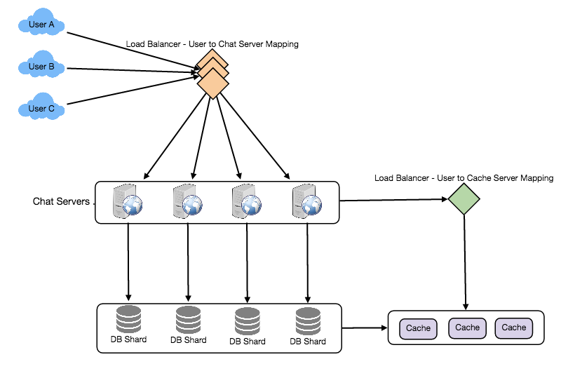
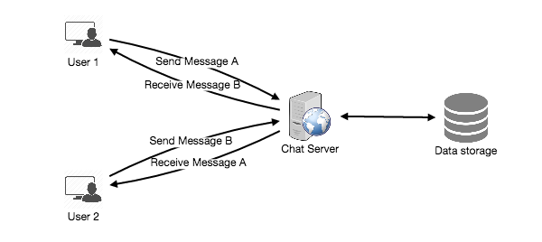
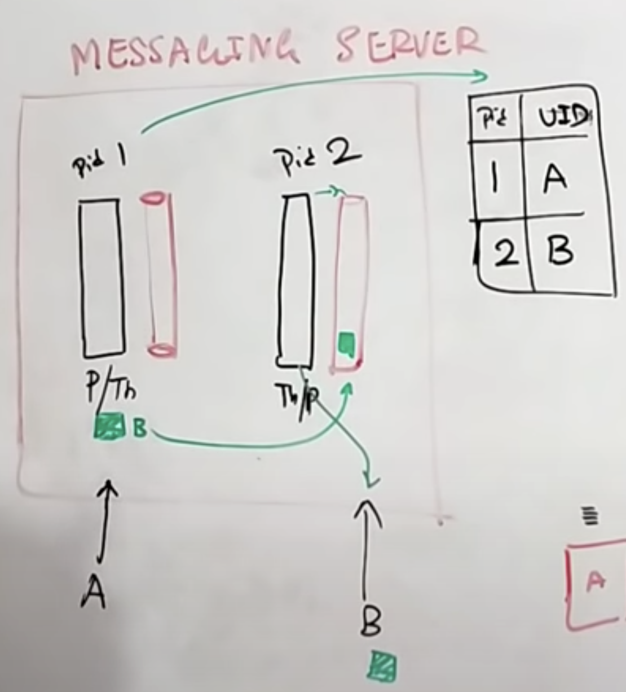
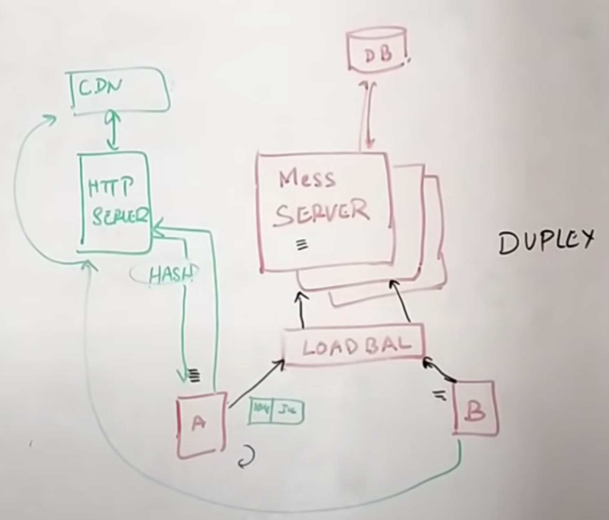

# Whatsapp

## Summary

## Requirements
- **Features**
  - ***Userbase*** 
  - ***Last Seen***
  - ***Media***
  - ***Encrypt***
  - ***Group Messages***
  - ***Chat History***

- **Good Practice**
  - ***Real time (low latency)***
  - ***Persistent***, users can same chat on all devices
  - Highly available, but ***Consistency > Availability***

## Estimations

- **Traffic estimates**
  - **500M** daily users, ***40 messages*** a day per user. This gives us ***20B*** messages per day.

- **Storage estimates**
  - Assume average message is ***100 bytes***
  - ***Total storage:*** `20 billion messages * 100 bytes` = **2 TB per day**

- **Bandwidth estimates**
  - ***Incoming/Outgoing:*** `2 TB / 86400 sec` = **25 MB/s**

## Basic System Design and Algorithm

### Messaging Feature
- **User 1 sends a message to User 2**
  - User 1 sends a ***message*** in the application
    - If there is ***no connection***, message is saved on ***local database***
  - User 1 establishes a ***duplex connection (bidirectional)*** to a process in the chat server and message is pushed to it. User is the one that always establishes the connection to the chat server
  - Message is ***saved*** into the ***database***
  

#### Checkmarks Feature Design 
- **One check**
  - ***Server received*** User's 1 message successfully and return message teling the User
- **Two checks**
  - Server sends message to User 2 and his device acknowledge the server he has received the message and the server updates two checks
- **Blue check check**
  - User 2 sends notifies server that the message was opened

#### Chat Server
When a connection is made, the chat server creates a ***process/thread*** that is in charge of dealing with messages comming from this connection (acknowlodging messages, routing messages, etc). There will be a ***queue*** per process made, which acts as a buffer for the incoming messages. 

If a user is ***not connected***, it won't have a process_id associated with his user_id and in that case the process will send the message to the database and when the user comes back, the process will take it and send it.
  - **Chat server table**
    Process | UserId
    ---- | ----
    `process_id` | `user_id`

### Last Seen Feature
When a user establishes a connection to a server, the server will be constantly sending a ***heartbeat*** and recording the last time of receiving the heartbeat on a table. When the user disconnects, the server stops sending the heartbeat and maintains the last timestamp until the user reconnects
  - **Last seen table**
    UserId | Timestamp
    ---- | ----
    `user_id` | `int`

### Media (audio/image/video) Feature
When a user A sends media to another user B, user A ***uploads*** the media to a HTTP server and then user A receives a ***hash*** with the media location on the server. The user A sends the hash as a message to user B and then user B can download the media using the hash

### Encryption Feature
We have two options:
- **Symmetric encryption**
  - One key shared between two parties
- **Asymmetric encryption**
  - We have a ***public key*** that is shared and a private key that each of the users have

### Group Messages Feature
When a user sends a message to a group. He sends it to the chat server and the chat server sees it has a `group_id` and sends the message to the ***group server*** which will see the `group_id`and return all the `user_id` associated with this `group_id`. 

This feature needs to be ***limited*** to a number of people (i.e. 200 for whatsapp) because the application is low latency and the servers sends the messages to the clients as soon as they get (instead of users pulling the messages), it will be heavy load to assign this tasks to big groups

## Data partitioning

- ***Partitioning based on UserID (preferred):*** 
  - Let’s assume we partition based on the hash of the UserID so that we can keep all messages of a user on the same database. If one DB shard is 4TB, we will have “3.6PB/4TB ~= 900” shards for five years. For simplicity, let’s assume we keep 1K shards. So we will find the shard number by “hash(UserID) % 1000” and then store/retrieve the data from there. This partitioning scheme will also be very quick to fetch chat history for any user. In the beginning, we can start with fewer database servers with multiple shards residing on one physical server. Since we can have multiple database instances on a server, we can easily store multiple partitions on a single server. Our hash function needs to understand this logical partitioning scheme so that it can map multiple logical partitions on one physical server.Since we will store an unlimited history of messages, we can start with a big number of logical partitions, which will be mapped to fewer physical servers, and as our storage demand increases, we can add more physical servers to distribute our logical partitions.

- ***Partitioning based on MessageID:***
  - If we store different messages of a user on separate database shards, fetching a range of messages of a chat would be very slow, so we should not adopt this scheme.

## Cache
We can cache a few recent messages (say last 15) in a few recent conversations that are visible in a user’s viewport (say last 5). Since we decided to store all of the user’s messages on one shard, cache for a user should entirely reside on one machine too.

## Load balancing
We will need a load balancer in front of our chat servers; that can ***map*** each UserID to a server that holds the connection for the user and then direct the request to that server. Similarly, we would need a load balancer for our cache servers.