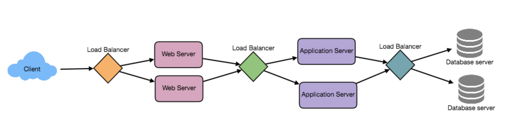

# SYSTEMS DESIGN CHEATSHEET
***
## Distributed Systems Characteristics
### - Scalability: 
Capability of a system to grow and manage increased demand
#### Types of scalability:
- **Vertical:** scaling refers to adding resources to a single machine
    - Examples: Buying more RAM, or higher CPU
- **Horizontal (preferred):** scaling refers to adding more machines
##### Pros:
- **Fault Tolerant:** There is not a single point of failure
- **Low latency:** You can have nodes located in different regions over the world that can decrease the amount of time it takes to get to your service from certain areas of the world
- There is going to be a point where it is cheaper

### - Reliability:
Probability that a system will fail
#### Key points:
- Make system redundant, so if a server fails, it can be replaced with another. Eliminate every single point of failure
- Redundancy has a cost and a reliable system is expensive

### - Availability:
Time that a system remains operational
#### Key points:
- An reliable system is available, but an available system doesn't mean is reliable
- Availability takes into account maintainability, repair time, spares availability and other logisitics considerations

### - Efficiency:
Composed by response time (latency) and throughput (bandwidth)
- **Latency:** Delay to obtain the first item
- **Bandwidth** Number of items delivered in a given time

### - Serviceability or Manageability:
Simplicity to maintain or repair the system

***
## Load Balancing

Distributes traffic across a cluster of servers to improve **effieciency** and **availability** of the system. Helps scale horizontally. Monitors servers and if a server is not available, LB will stop sending traffic to such server. LB regularly do **health checks** to servers to see if they are up and if the servers fail them traffic will not be redirected to such a server. LB can be a single point of failure, so it is smart to have a **replacement LB** in case the first goes down

#### Locations of load balancer:
- **Between user and web server** 
- **Between web server and internal platform layer** 
- **Between internal platform layer and database** 

### Benefits:
- Faster user experience
- Less server downtime
- Easier to handle incoming requests
- Predictive analytics that determine traffic bottlenecks before they happen

#### Load Balancer Algorithms:

- **Least Connection Method:** Redirects traffic to server with **fewer active connections**. Useful when clients have multiple persistent connections 
- **Least Response Time Method:** Redirects traffic to server with **fewer active connections** and **lowest average response time** 
- **Least Bandwidth Method:** Redirects traffic to server with **least amount of traffic** measured in megabits per second
- **Round Robin Method:** Repeatedly cycles through a list of servers and sends traffic to the **next server on the list**. Userful when server have the same specifications and there aren't many persistent connections
- **Weighted Round Robin Method:** Each server has a weight depeding on its processing capacities and server with **higher weights receive more connections** 

***
## Caching
Enable to **improve** the usability of the **current resources** by using the principle **recently requested data is likely to be requested againg**. 
#### Types of cache:
- **Application server cache:** Application will look to local cache to see if requested data exists. If it doesn't, it will query data from disk. 
- **Content Delivery Network:** CDN are used to serve large amounts of static media 
#### Cache invalidation:
Cache must become **invalid** if it's modified in the **database**
##### Types of cache invalidation::
- **Write-through cache:** Data is writted into cache and to the database at the **same time**. Disadvantage is higher latency for write operations
- **Write-around cache:** Writes directly to **permanent storage**
- **Write-back cache:** Data is written to cache alone. Low latency for write intensive applicaitons
#### Cache eviction policies: 
- **FIFO:** First In First Out
- **LIFO:** Last In First Out
- **LRU:** Least Recently Used
- **MRU:** Most Recently Used
- **LFU:** Least Frequently Used
- **RR:** Random Replacement

***
## Sharding or Data Partitioning
Process of **splitting** up a database across multiple machines to improve manageability
#### Patitioning methods:
- **Horizontal paritioning:** Split data in sections per database. For example, Database 1 stores users A-G. Problem is that might lead to unbalanced servers
- **Vertical paritioning:** Divide data related to a specific feature in their own server. For example, one table might ahve information about user's profile and another information about user's friend list
- **Directory based paritioning:** Create a lookup service which knows the partitioning scheme and abstracts it, so we query the directory server that has the mapping between each key and the DB server location

***
## Proxies
Intermediate server between client and backend server used to filter requests, log requests, or transform requests. 
#### Proxy Server Types:
- **Open proxy:** Accessible to any Internet user
- **Reverse proxy:** Lives inside the system design and get resources from servers and return to client appearing that all resources originated from the proxy server

***
## Distributed Datastores

The way distributed datastores work is by having a cluster of nodes(databases), where each node have a **primary responsibility** of storing some kind of unique data and a **secondary reponsibility** of storing a part of the data of another node. The way this is done is by having a hashing stating which node is the corresponding of backing up which part of the data of other node. The reason to backup a part of the data is to increase the **fault tolerant** capabilities of our system design since in the case of a region of multiple nodes going down, in most cases we will have parts or ideally all of the backup saved on other nodes.

### CAP Theorem:
- **Consistency:** The read value return from the database is always the latest write value
- **Availability:** The application is always available to write/read even if we take down any db node
- **Partition tolerant:** The application must be working even if we take out the connection between db nodes

Basically, you can only pick two. For highly available applications that need to be up all the time, the best choice would be **availability** and **partition**, and having a **eventually consistent** data. This means, that the data may have some buffering time to synchronize. 

### SQL vs NoSQL
#### SQL: 
Relational databases are structured and have predefined schemas. Store data in rows and colums. Each row contains all the information about one entity and columns contains separate data points
- **Example:** Phone books taht store phone numbers and addresses
- **ACID:** Type of majority of SQL databases are ACID
- **Providers:** Mysql, Oracle, MS SQL, SQLite, Postgres, MariaDB

#### NoSQL:
Non-relational databases are unstructured, distributed, and have dynamic schema
- **Example**: Folder that hold everything from a person's address and number to their online shopping preferences
- **BASE:** Basically Available Soft Estate Eventually Consistent
- **Providers:** Redis, Dynamo, Cassandra, MogoDB,
#### Storage
- **SQL:** Stores data in **tables** 
- **NoSQL:** Main storage models **key-value, document, graph, columnar**
#### Schema
- **SQL:** Each record needs to follow the format of the initial **fixed schema**. To change the schema, it is needed to modify the whole database and go offline 
- **NoSQL:** Schemas are dynamic. Each row does not need to contain data for each column
#### Scalability
- **SQL:** Commonly vertically scalable. Horizontally scaling involves sharding techniques
- **NoSQL:** Easily horizontally scaleble
#### Choosing
- **SQL:** 
    - **ACID** Compliance, which reduces anomalies and protects integrity of db 
    - Data is **structured** and **unchanging** 
    - Data reliability and safe guarantee of performing transactions
- **NoSQL:** 
    - Storing **large volumes** of data that have little to no structure
    - Easily **scalable**
    - Rapid development

##### Notes:
- Entity Relation Diagram = Tables
***
## Distributed Locks

A **lock** allows only one thread to enter the part that's locked and the lock is not shared with any other processes.

A **mutex** is the same as a lock but it can be system wide (shared by multiple processes).

A **semaphore** does the same as a mutex but allows x number of threads to enter, this can be used for example to limit the number of cpu, io or ram intensive tasks running at the same time.

There are times when using distributed systems that multiple nodes want to access the **same resource**, which can be dangerous since they both can modified it without wanting this as the expected behavior. To handle this scenarios we need a **lock manager**, which administers which node can access to which resource. 

In a distributed design, it is optimal to have **distrbuted locks**. 

#### Distributed Locks Properties:

- **Fault tolerance:** To avoid single points of failure, we need to have multiple nodes replicating the information of current locked resources to which nodes. 
*The problem that originates with this is that if we replicate the information and the main node having the lock manager approver goes down, we end up without knowing what lock information is true*
- **Truthfulness:** To achieve multiple points of truth, all the nodes that we use to replicate information need to become **lock managers** and the way we verified that the lock manager approve a resource to some node is by adding **multiple lock manager approvals** a commonly number use for this is **n/2 + 1**, which says that as long as half of the lock managers approve it, the resource is assigned to that node. 

**Example:** Suppose we have a distributed system that is in charge of bank transactions. The way the transactions are made is by using ***ditributed locks*** to ensure that two transactions involving withdrawals from the same account at exactly the same time to make a payment to another account are synchronous and the withdrawal account gets charged correctly.

#### Types of locks

- **Pessimistic Lock:** Most commonly used type of lock. ***Pessimistic locking*** is when you take an exclusive lock so that no one else can start modifying the record.

- **Optimistic Lock:** ***Optimistic Locking*** is when you check if the record was updated by someone else before you write the record back. Better for when there are a few conflicts(nodes trying to update same resource) in application.

***
## Internet protocols and connections
#### Types of protocols:
- **TCP:** Protocol used to transfer content over the internet. Used for loading web content. It requires a ***handshake*** between client and server before the information is sent
- **UDP:** Protocol used to transfer ***time sensitive*** content over the internet. It is very quick because it ***doesn't require a handshake***
- **HTTP/S:** ***Application protocol*** that is used to access www
    - **Default port:** 80 and 443 for secured
- **FTP:** Most common protocol to ***transfer files***
    - **Default port:** 20
- **SSH:** Used to manage devices securily in a network at ***command level***
    - **Default port:** 22
- **SMTP:** Used to transfer ***emails*** from source to destination
    - **Default port:** 25 and 463 for secured
- **SSH:** Used to manage devices securily in a network at ***command level***
    - **Default port:** 22

#### Types of connections:
- **Polling:** ***Client*** makes a request using HTTP and server sends response back to client
- **Websocket:** ***Bidirectional persistent communication*** between the client and server over TCP connection, where both can send/recieve data
- **Server Sent Events (SSE):** Client requests data using HTTP and connection is open and ***server*** sends data whenever new information is available

